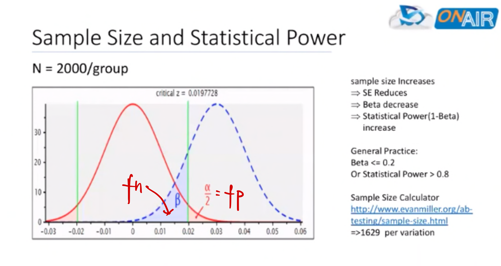

# A/B Testing Common Questions


```
- original post time: 2020/02/09
- Update time: 2020/03/22
- Lasest Update time: 2020/03/31
```


# General Questions

**<u>General Questions You Should Be Aware Of:</u>**

- **What is A/B Testing?**

  the idea is to challenge an existing version (A) with a new one (B), by randomly splitting traffic and comparing metrics on each of the splits.
  
- **Why ABT**

  By measuring the impact that changes have on your metrics, you can ensure that every change produces positive results. Nowadays it’s very common for companies to do A/B tests on web page versions, personalized recommendations and new features.
  
- **When is A/B Testing a good idea? When is it a bad idea?**

  A/B Testing cannot test haven't existed yet. It also has issue with testing new products. It cannot to measure long-term effect. If a feature takes a long time to be effective, AB Testing might not be a good solution. It has novelty effect.
  
- **What is a Null Hypothesis/Statistical Significance?**

- **Why we want to do randomization, can we do matching?**
  Sure, we can definitely do matching when we are unable to do randomization.
  One advantage of conducting randomization is that randomization can make sure the distribution is the same for every dimension while matching can only control those aspects you observed. For unobserved confounding, you can no control on them.
  So most of the time, we prefer randomization and do more randomization as more as we can.

- **When Multiple Experimentation, if the alpha = 0.05....**
  If there are 20 groups in total, your actually statistically significance is 0.05 / 20
  Your overall alpha is still 0.05. However, if you want to only conclude the result for one group, it should be divided by 20.
  Let's say if we don't want to conduct type I error for all the groups, the probability will be 0.05^20. So the probability of at least conducting type I error once is 1-0.05^20. 


**What are the main steps in A/B Testing?**

- Identify your goal under business needs
  - Customer funnel
- Pick one variable to test / Primary goal & Secondary goal
  - CTR, bounce, conversion, renewal rate, average retention 
- Hypothesis Setup
- Create a 'control' and a 'testing' group
  - Split samples groups equally
  - Simple Randomization 
  - Block Randomization
- Determine sample size
  - If this experiment has finite audience, then we might need to do the test longer to make sure there is enough interactions to gain a statistical result.
- Decide how significant you results need to be 
- Make sure you're only running one test at a time on any campaign
  - Multi-variable test
- Launch?
  - Consider the cost
  - Network effect
  - Novelty effect


**How and when to do block randomization**

For example, for Uber, we need to know that if you give some drivers more competitive advantage in the market, they will beat nearby drives which leads to imbalance resources. So we might focus on <u> block randomization</u>. 

Based on different market (country, cities) , do block randomization.

Market1 - Testing Group

Market2 - Control Group

For sample size calculation , the solution remains the same. 

The **Caveat** for this problem is that within the group/market, customer might have higher correlation than standard A/B Testing randomization which means we should be cautious and might need to increase the sample size to increase the confidence/credibility of this case. The correlation across markets is fine.


 **How long to run the experiment?**

[AB Testing Geo-hashing](https://www.1point3acres.com/bbs/thread-543126-1-1.html)

For now I don't have an answer for this question, but based on my understanding, we should consider several aspects including:

1. The sample size. How long are we able to collect enough sample size. 
2. The product/customer cycle. The experiment should run at least for one cycle for customers. Here I mean at least one week or something to avoid some time factors. Like if you only run your test through Monday to Friday. When you actually launch the test, the result might be different because people behave differently in the weekends. 


**How to make your result more confidence?**

You can increase in confidence by A increase the confidence level which means you can change your significant level and increase the power.

You can increase the power. A) increase the sample size , so you can either open your experiment to attach more traffic or longer time


**How to mitigate change aversion problem?**

[Source Link](https://teamcroco.com/how-our-natural-aversion-to-change-can-impact-a-b-test-results/)

- Change incrementally and communicate well
- Provide instructions and support
- Provide feedback channels

In addition, since you know there will be change aversion problem, users need time to get used to it, it's better to run a longer experiment to have a solid result. You should also make decision based on your domain knowledge. For example, you know people's users might change after three weeks, so you should conduct the experiment for at least three weeks. 


# Assumption of A/B Testing 

- Samples are independent


# Network Effect

[The-pitfalls-of-a-b-testing-in-social-networks](https://tech.okcupid.com/the-pitfalls-of-a-b-testing-in-social-networks/) 

[Detecting-interference--an-a-b-test-of-a-b-test](https://engineering.linkedin.com/blog/2019/06/detecting-interference--an-a-b-test-of-a-b-tests) - Linkedin

[Detecting Network Effect - Youtube](https://www.youtube.com/watch?time_continue=224&v=E3yiKJCgLE4&feature=emb_logo)

A/B testing is, of course, common practice in a large range of settings, from drugs and vaccines to web applications. However, most methods rely on a strong assumption: when comparing feature A and feature B, the behavior of feature A users is not impacted by the activity of feature B users. In other words, most methods assume that there is no interference, which is sometimes called "network effect," between features. 


Imagine this: my friend is targeted for an experiment that gives her a better messaging experience. I am not targeted, and my messaging experience doesn’t change. However, her better messaging experience causes her to spend more time on the site and send more messages, including some to me. I then respond to her, and spend more time on the site as well. What happened here? The fact that my friend received a new feature had an impact on me, even though I was not part of the experiment. There is interference.


**Detection**

Our approach is simple: 

- We cluster the LinkedIn graph into 10,000 clusters. The graph comprises all active LinkedIn members as nodes and their “connections” as edges. 
- We then split these clusters into two parallel experiments:
- **A)** An individual-level experiment, where members are sorted randomly into treatment or control groups.
- **B)** A cluster-based experiment, where a whole cluster (i.e., community) of users is either in treatment or in control. In other words, if I am treated, a significant proportion of my connections are also treated. If I am part of the control group, a significant proportion of my connections are also under control.


The key intuition is that if there is no network effect, both of these experiments should give us the same estimated effect. 


**Using per-*community* random assignment**

One alternative to per-user random assignment is to use per-*community* random assignment. In this case, a "community" is any group of users whose interactions are primarily directed to other users within the same group. Data teams at [LinkedIn](https://engineering.linkedin.com/ab-testing/introduction-technical-paper-linkedins-ab-testing-platform) and [Instagram](https://www.facebook.com/atscaleevents/videos/1856120757994353/) have discussed their own uses for community-based A/B testing, but the hard part is figuring out how to define a "community" for your specific product.

A common mathematical approach to defining user communities is to model the relationships between users with a [social graph](https://en.wikipedia.org/wiki/Social_graph), and then apply graph partitioning algorithms to find isolated, non-interacting groups.

For many social websites and apps, it's easy to translate the user interactions (*e.g.*, messaging, friending, connecting, following) into a graph. Each user is a node, and edges are placed between nodes that have had some interaction. Then, you can apply graph partitioning methods -- such as [Normalized Cuts](https://people.eecs.berkeley.edu/~malik/papers/SM-ncut.pdf) -- to partition the nodes into groups with lots of within-group connections and relatively few between-group connections.

However, the social graphs for dating apps are a bit different from those that arise in other social media platforms. In dating apps, a typical user is focused on finding new people to talk to rather than maintaining contact with existing connections, so the community is really defined by "anybody that's near you" as opposed to "people you have a history of interacting with". Rather than building a social network to describe connections between pairs of users, I created a "geo-social network" by calculating how frequently connections were made between pairs of *locations*. When graph partitioning was applied to this graph, we get a set of geographic regions that can serve as different test regions for our experiments.


community感觉有好多种方式

一个是by social graph（facebook instagram）

一个是by 距离的远近 （dating app）

一个是by 城市 （uber）


# Statistical Concepts

**P-Value**

The p-value is the probability of obtaining at least as extreme results given that the null hypothesis is true. In other words, the p-value is the expected fluctuation in a given sample, similar to the variance.

In AB testing, the p-value is the difference we would see across samples if we ran an A/B test.


**Significance Level**

The significance level is the probability of rejecting the null hypothesis is given that it is true. It's a value we set based on the level of accuracy we deem acceptable.

In AB testing, the significance level is the industry standard 5% we use to give us results with 95% confidence.


**Statistical Hypothesis Testing**

An AB test is an example of statistical hypothesis testing, a process whereby a hypothesis is made about the relationship between two data sets and those data sets are then compared against each other to determine if there is a statistically significant relationship or not.

To put this in more practical terms, a prediction is made that Page Variation #B will perform better than Page Variation #A, and then data sets from both pages are observed and compared to determine if Page Variation #B is a statistically significant improvement over Page Variation #A.


**Data Sample**

A data sample is a set of data collected and/or selected from a statistical population by a defined procedure. It's a small portion of the larger population.

In AB testing, the sample is the number of visitors we display our new page variation too in order to collect data.


**Mean**

The mean is the central tendency of a probability distribution.

In AB testing, the mean is our page's conversion rate with the sample visitors.


**Variance**

The variance is a measure of variability across samples. It is officially the expectation of the squared deviation of a random variable from its mean.

In AB testing, the variance affects the sample size we need in order to have a chance of deriving statistically significant results.


**Regression to the Mean / Statistical Regressoin**

Regression to the mean is the phenomenon that if a variable is extreme on its first measurement, it will tend to be closer to the average on its second measurement.

In AB testing, this phenomenon ensures that as we continue increasing the sample size and the length of observation, the mean of our cumulative observations will get closer and closer to the true mean of the population.


**Statistical Population**

In statistics, a population is a set of similar items or events which is of interest for some question or experiment. It's the group we want information about.

When AB testing a webpage, the true population is every future individual who will visit that page


**Confidence Level & Interval**

The confidence interval is an observed range in which a given percentage of test outcomes fall. The confidence interval is determined by the confidence level we manually select at the beginning of our test and influences the sample size required.

In AB testing, the confidence level is usually set to 95%, which gives us a range (the confidence interval) in which we know the mean will fall in at least 19 of 20 samples.


**Margin of Error**

The margin of error is a statistic expressing the amount of random sampling error in a sample's results. The margin for error is a function of the standard deviation, which is a function of the variance. Really all you need to know is that all of these terms are measures of variability across samples.

The margin of error is added to and subtracted form the mean to determine the confidence interval.


**Null Hypothesis**

The null hypothesis is a baseline assumption that there is no relationship between two data sets. When a statistical hypothesis test is run, the results either disprove the null hypothesis or they fail to disprove the null hypothesis.

In AB testing, the null hypothesis is the assumption that the original page and the new page variation have no statistical significant relationship.


**Statistical Significance**

Statistical significance is attained when the p-value is less than the significance level. And that is way too many new words in one sentence, so let's break down these terms real quick and then we'll summarize the entire concept in plain English.

In AB testing, statistical significance is how we verify that a new page truly outperforms the original.


**Statistical Power**

Statistical power is the probability that a test correctly rejects the null hypothesis.


**Type I Error**

Alpha - false postive

A type I error occurs when we incorrectly reject the null hypothesis.

In AB testing, a type I error would occur if we concluded that Variation B was "better" than Variation A when it actually was not. These errors are avoided by achieving statistically significant results.


**Type II Error**

Beta - false negative


A type II error occurs when the null hypothesis is false, but we incorrectly fail to reject it.

To put this in AB testing terms, a type II error would occur if we concluded that Variation B was not "better" than Variation A when it actually was better. These errors are avoided by running tests with a high statistical power.




**Overall Evaluation Metric (OEC)**

One overall metrics


**Long Term Effect**

[Long-term experiment](https://en.wikipedia.org/wiki/Long-term_experiment)

A **long-term experiment** is an [experimental](https://en.wikipedia.org/wiki/Experiment) procedure that runs through a long period of time, in order to test a [hypothesis](https://en.wikipedia.org/wiki/Hypothesis) or observe a phenomenon that takes place at an extremely slow rate.

For example,

 You want to test if two referral coupons are effective for customers on a hotel-rental website. Since people don't visit Hotel very often, it may takes some time to be effective

- How to solve long-term effect?

  Short development cycles, incurs engineering cost, non-persistent user tracking and interactions

  Use short-term goal to measure long-term effect by inference


**Network Effect**

A **[network effect](https://en.wikipedia.org/wiki/Network_effect)** (also called **network externality** or **demand-side economies of scale**) is the effect described in [economics](https://en.wikipedia.org/wiki/Economics) and [business](https://en.wikipedia.org/wiki/Business) that an additional user of [goods](https://en.wikipedia.org/wiki/Goods) or [services](https://en.wikipedia.org/wiki/Service_(economics)) has on the [value](https://en.wikipedia.org/wiki/Value_(economics)) of that product to others. When a network effect is present, the value of a product or service increases according to the number of others using it.

The classic example is the telephone, where a greater number of users increases the value to each. A positive externality is created when a telephone is purchased without its owner intending to create value for other users, but does so regardless. Online social networks work similarly, with sites like Twitter and Facebook increasing in value to each member as more users join.


# Novelty Effect

- **How to avoid Novelty effect?** 

  **We ran an A/B test. Test won, so we make the change on the site for all users. But after waiting for some time, we realize that the new version of the site is not performing better than the old one. What could be the reason?**

  **Assume there was no technical or statistical problem with the test, and the reason has to do with user behavior**

  (From collection data challenge)

  This question is also really common and can be rephrased in tons of ways. Sometimes they directly ask you about novelty effect, but more often they give you some test results and you have to explain them.

  The main reason a situation like the one described in the question happens is because of novelty effect. That is, when a site puts up a small new feature, at first users tend to engage with it a lot out of curiosity and to try it out. As novelty wears off and users get used to it, they go back to their normal behavior.

  Obviously, this can have a very bad impact on test result reliability, since tests measure the impact of a change over a small period of time and use that data to estimate what would happen in the long run.

  A good proxy to check for novelty effect is:

  

  

  **IMPORTANT**

  1. From your test results, only consider users for which it was the first experience on the site. First time users are obviously not affected by novelty effect.

  2. Look at test results between new users in the control group vs new users in test group
  
  3. If test group is winning overall, but not winning for the new user subset, it is a big warning that your results might be affected by novelty effect. Especially in cases like the one of the question where you already know that some time after making the change, you saw no improvement.
  
  


# Metrics

**Count**

- Page View
- Visit / Session
- Click
- Visitor / Unique Visitors
- Active Users (DAU, MAU)

**Conversion**

- Click Thru Rate (CTR)
- Click Thru Probability

## Bounce Rate

[Explanation from Optimizely](https://www.optimizely.com/optimization-glossary/bounce-rate/)

**What is Bounce Rate?**

Bounce rate is the percentage of site visits that are single-page sessions, with the visitor leaving without viewing a second page. It is typically used as a measurement of a website’s overall engagement.

**How is Bounce Rate Calculated?**

Bounce rate is calculated by the total number of one-page visits divided by the total number of entries to a website. For example, if the homepage of a website receives 1,000 visitors over the course of a month, and 500 of those visitors leave the site after viewing the homepage without proceeding to any other pages, then the bounce rate of the homepage would be 50%.


**Time**

- Active Time
- Page View Duration

**Business**

- Revenue 
- Member
- Order

**Ads Analytics**

- Impression
- Click

**Composite Metric**

- retention
- Acquisitive  
- Percentage user using xxx Out of active user
- sketch competitors
- Adobe competitors
- Brewer base. 你可以很简单用产品 windows也可以。很多时候Mac才能做design 但是很多用户mac普及没有那么广. Make design accessible for all. Collaboration!!!
- 上周四 user conference! 


# Experiments

**Quesions**

- How big is the sample size

- How long to run the experiment?

  不能太长 别让大家知道你已经有了新的version 不让大家知道你在ab

- How much traffic% for testing?

- How to divide the % of the traffic for testing?

- What's the target audience of the testing?


**What metrics do you want to improve?**

**Can you think of some variations can be made?**

**What change do you want to test? Why?**

**How many visiits/sample size do I need?**

**Can you calculate the practical significance (given costs)?**

**Will you launch the variation? (Given the test result)**

**How big is the sample size**

**How much traffic% for testing?**

**How to divide the % of the traffic for testing?**

**What's the target audience of the testing?**


# Common Mistakes

Resources from [link](https://www.widerfunnel.com/3-mistakes-invalidate-ab-test-results/)


**<u>Try not to test multiple variations</u>** 


**Mistake #1: Your test has too many variations**

1. **Longer time**
2. **Larger traffic**

The more variations, the more insights you’ll get, right?

Not exactly. Having too many variations slows down your tests but, more importantly, it can impact the integrity of your data in 2 ways.

**First**, the more variations you test against each other, the more traffic you will need, and the longer you’ll have to run your test to get results that you can trust. This is simple math.

But the issue with running a longer test is that you are more likely to be exposed to cookie deletion. If you run an A/B test for more than 3–4 weeks, the risk of sample pollution increases: in that time, people will have deleted their cookies and may enter a different variation than the one they were originally in.

**Second risk** when testing multiple variations is that the significance level goes down as the number of variations increases.

In other words, the more variations, the higher the chance of a false positive i.e. the higher your chances of finding a winner that is not significant.

**Mistake #2: You change experiment settings in the middle of a test**

When you launch an experiment, you need to commit to it fully. Do not change the experiment settings, the test goals, the design of the variation or of the Control mid-experiment. And don’t change traffic allocations to variations.

Changing the traffic split between variations during an experiment will impact the integrity of your results because of a problem known as [Simpson’s Paradox](https://en.wikipedia.org/wiki/Simpson's_paradox).This statistical paradox appears when we see a trend in different groups of data which disappears when those groups are combined.


# Appendix

Some concepts are from forum 1point3acre. I adjusted them and appended my own content. 


# Resources

- [5 Validity Threats That Will Make Your A/B Tests Useless](https://splitbase.com/ab-testing-threats/)
- [Summary of Udacity ABT](https://towardsdatascience.com/a-summary-of-udacity-a-b-testing-course-9ecc32dedbb1):
- [Common ABT questions and answers for them from 1p3](https://www.1point3acres.com/bbs/thread-532567-1-1.html)
- 