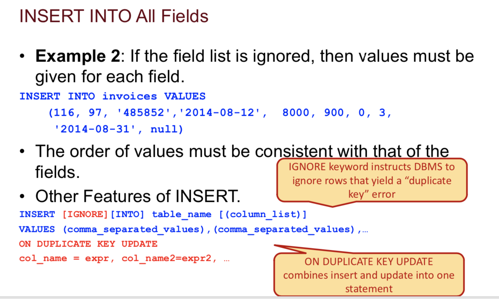

---

layout:     post
title:      SQL Summary
subtitle:   Mysql, Database
date:       2020-02-09
author:     Xiangke
header-img: img/post-bg-keybord.jpg
catalog: true
tags:
    - Data Analysis
    - SQL
    - DataBase
---


# Short Answers

## Join Table by Where vs by On

[link](https://stackoverflow.com/questions/2722795/in-sql-mysql-what-is-the-difference-between-on-and-where-in-a-join-statem)

The `ON` clause defines the relationship between the tables.

The `WHERE` clause describes which rows you are interested in.

Many times you can swap them and still get the same result, however this is not always the case with a left outer join.

> - If the `ON` clause fails you still get a row with columns from the left table but with nulls in the columns from the right table.
> - If the `WHERE` clause fails you won't get that row at all.


## Join VS Subquery

Join is also called **Cartesian Product**

Answer quoted from [mysql](https://dev.mysql.com/doc/refman/5.7/en/rewriting-subqueries.html): 


```
A LEFT [OUTER] JOIN can be faster than an equivalent subquery because the server might be able to optimize it better—a fact
that is not specific to MySQL Server alone. Prior to SQL-92, outer joins did not exist, so subqueries were the only way to do certain things. Today, MySQL Server and many other modern database systems offer a wide range of outer join types.
```

Answer quoted from [Stackoverflow](https://stackoverflow.com/questions/2577174/join-vs-sub-query):


For me, I'll say that subquery looks easier, more readable and understandable versus join. And you should keep in mind that there might be **duplicate** records while using join query. So you should always keep cautious. 

**Exercise**

```
Find ID whose years in 2016 not in 2017, you can't use subquery,
only one select statement
+---+-----+
|ID | Year|
+---+-----+
|1  | 2016|
|1  | 2017|
|2  | 2017|
|3  | 2016|
+---+-----+
```

This Question restrain you only use one `select` statement without any subquery ( left join (select * from xxx)) is forbidden too)

The solution below shows the technique using `join` and `on` to achieve the same effect of using subquery

**Most important is to note that `on T2.year = 2017`**

You should also be skilled at using combination of `left join` and `is null`

```mysql
SELECT DISTINCT *
  FROM ID_Year T1
  LEFT JOIN ID_Year T2 ON T1.ID = T2.ID AND T2.year = 2017
 WHERE T1.year = 2016
   AND T2.year IS NULL
```


## SQL vs NoSQL

[Sql vs Nosql](https://www.guru99.com/sql-vs-nosql.html)

| **Parameter**    | **SQL**                                                      | **NOSQL**                                                    |
| ---------------- | ------------------------------------------------------------ | ------------------------------------------------------------ |
| Definition       | SQL databases are primarily called RDBMS or Relational Databases | NoSQL databases are primarily called as Non-relational or distributed database |
| Design for       | Traditional RDBMS uses SQL syntax and queries to analyze and get the data for further insights. They are used for OLAP systems. | NoSQL database system consists of various kind of database technologies. These databases were developed in response to the demands presented for the development of the modern application. |
| Query Language   | Structured query language (SQL)                              | No declarative query language                                |
| Type             | SQL databases are table based databases                      | NoSQL databases can be document based, key-value pairs, graph databases |
| Schema           | SQL databases have a predefined schema                       | NoSQL databases use dynamic schema for unstructured data.    |
| Ability to scale | SQL databases are vertically scalable                        | NoSQL databases are horizontally scalable                    |


**KEY DIFFERENCE**

- SQL pronounced as "S-Q-L" or as "See-Quel" is primarily called RDBMS or Relational Databases whereas NoSQL is a Non-relational or Distributed Database.
- SQL databases are table based databases whereas NoSQL databases can be document based, key-value pairs, graph databases.
- SQL databases are vertically scalable while NoSQL databases are horizontally scalable.
- SQL databases have a predefined schema whereas NoSQL databases use dynamic schema for unstructured data.
- SQL requires specialized DB hardware for better performance while NoSQL uses commodity hardware.

---

https://stackoverflow.com/questions/46856267/implement-rank-without-using-analytic-function)


## Count(1) Vs Count(*)

[Link](https://searchoracle.techtarget.com/answer/COUNT-or-COUNT-1)

The difference is simple: 

**COUNT(\*) counts the number of rows produced by the query, whereas COUNT(1) counts the number of 1 values.** 

Note that when you include a **literal** such as a number or a string in a query, this literal is "appended" or attached to every row that is produced by the FROM clause. This also applies to literals in aggregate functions, such as COUNT(1). It's hard to imagine a scenario where the COUNT(*) and COUNT(1) values would be different, so please do let me know if you find one.

In general, you should always use COUNT(\*). This is because the database can often count rows by accessing an index, which is much faster than accessing a table. If you use COUNT(*column*), the database must actually inspect the individual values in the column, since it will not count NULLs. Aggregate functions like COUNT and SUM always ignore NULLs.

One would like to assume that the database optimizer is smart enough to realize that the literal value 1 will never be NULL, and not need to inspect it on every row, but it also would not surprise me to find out that the actions of appending the 1s into every row produced by the FROM clause and counting the 1s are handled by two separate logic modules, and maybe the module doing the counting doesn't know where the 1s came from. So just use COUNT(*).


In terms of result,

- count(*) == count(1) == count(any number here)
- count(column_name) eliminate NULL
- count(distinct columnn_name) eliminate duplicates


## Left Join vs Right Join

- **INNER JOIN:** returns rows when there is a match in both tables. 

- **LEFT JOIN:** returns all rows from the left table, even if there are no matches in the right table. 

- **RIGHT JOIN:** returns all rows from the right table, even if there are no matches in the left table.


## Short-Short Answers

- The result of `1+NULL`

  ```
  null
  ```

- Filter from group result

  ```
  having clause
  ```

- 


# Data Definition Language (DDL)

## Query

`create database [name]` = `create schema [name]`

```mysql
CREATE TABLE Employee (
  empId INTEGER NOT NULL AUTO_INCREMENT PRIMARY KEY, 
  empSSN CHAR(11) NOT NULL UNIQUE, 
  ...)
```

`Drop database [name]` this will delete an entire database in the blink of an eye, you should be careful

`Drop Table [name]`  when you have a reference, you cannot delete the table directly

`Auto_increment` generate unique IDs

```mysql
CREATE TABLE Employee (
  empId INTEGER NOT NULL AUTO_INCREMENT PRIMARY KEY,
  ...)
```

`Alter Table`  if you want to change a table

```mysql
ALTER TABLE Student ADD COLUMN birth_year INT;
ALTER TABLE Student DROP COLUMN birth_year;
ALTER TABLE Student MODIFY COLUMN birth_year CHAR(4);
```

`Describe Table` to get information for a particular table

`Show tables` to show all tables in the current database


## Data Types

- INT / BIGINT / TINYINT / FLOAT / DOUBLE
- DATETIME [YYYY-MM-DD HH:MM:SS] / 
  DATE [YYYY-MM-DD] / 
  TIMESTAMP [YYYY-MM-DD HH:MM:SS]
  Timestamp may vary according to the time zone while datetime don't change
- CHAR / VARCHAR

-----

# Data Manipulation Language (DML)

## Insert

**Insert into a subset of fields**


**Insert Into All fields**



**Insert into (from another table)**


----

## Update

```
Be careful with UPDATE, if the WHERE clause is missing, it will update every row with the same values
```


Update table_name SET column_1 = expression_1 WHERE xxx

Update clause can also used with subquery

## Delete

`Delete [FROM] table_name [WHERE search_condition]`

## Selection


## JOIN

Simulate a `full outer join` in mysql. There is no full outer join in mysql

And we can use `left join` , `union all` and `right join` to mimic it

```mysql
SELECT  department_number,
		department_name,
		employee_id,
		first_name,
		last_name
  FROM  employees AS E
  LEFT  JOIN  departments AS D USING(department_number)
UNION ALL
SELECT  department_number,
		department_name,
		employee_id,
		first_name,
		last_name
  FROM  employees AS E
 RIGHT  JOIN departments AS D USING(department_number)
 WHERE  employee_id IS NULL;
```


# Advanced SQL 

## With Statement

- **Recursive Query**

  Read the example and learn how to write recursive query

  ```mysql
  WITH RECURSIVE cte AS (
  SELECT *, 1 AS level
    FROM employees
   WHERE first_name = 'Paulo' AND last_name = 'Locario'
  UNION ALL
  SELECT E.*, t.level+1 as level
    FROM employees AS E
    JOIN cte T ON E.manager_id = t.employee_id
  ) 
  SELECT last_name,first_name,level from cte 
  ORDER BY employee_id;
  ```

  The sequence of writing a recursive query is that you need to find a base case first, usually with a `where` constriction. And then, you `UNION ALL` the same table, the `CTE` table and join on the condition. Much easier than Python query.

## Functions

### String Selection

Filter for string condition

```mysql
-- 10. (I do) Show all vendors with names beginning with A to L
SELECT * 
  FROM vendors
 WHERE vendor_name < 'M';
```

### String Functions

- **concat()**

`concat(string / col, string / col / , ...)`

**Example**

```mysql
SELECT concat(first_name,' ',last_name) AS vendor_names
FROM vendor_contacts;
```

- Like  / Not Like

- **SUBSTR(string, start, length)**

  `SELECT SUBSTR("SQL Tutorial",5,3)` Return Tut

  `SELECT SUBSTR("SQL Tutorial",5)` start from position 5 and select till the end

- **INSTR(string1,string2)**

  The INSTR() function returns the position of the first occurrence of the searched string2.

- 

### TIME FUNCTIONS

**DATE_TIME**

date_time(date, format)

| Specifier | Description                            |
| --------- | -------------------------------------- |
| `%c`      | Month, numeric (`0`..`12`)             |
| `%d`      | Day of the month, numeric (`00`..`31`) |
| `%e`      | Day of the month, numeric (`0`..`31`)  |
| `%H`      | Hour (`00`..`23`)                      |
| `%h`      | Hour (`01`..`12`)                      |
| `%I`      | Hour (`01`..`12`)                      |
| `%i`      | Minutes, numeric (`00`..`59`)          |
| `%k`      | Hour (`0`..`23`)                       |
| `%l`      | Hour (`1`..`12`)                       |
| `%m`      | Month, numeric (`00`..`12`)            |
| `%s`      | Seconds (`00`..`59`)                   |
| `%T`      | Time, 24-hour (*`hh:mm:ss`*)           |
| `%Y`      | Year, numeric, four digits             |
| `%y`      | Year, numeric (two digits)             |
| `%%`      | A literal `%` character                |


- **DATEDIFF(exp1, exp2)**

  Return `exp1 - exp2` by days

- **TO_DAYS(Date)**

  Return days of the date 

- **CURRENT_DATE()** / **CURDATE()**

  Return current date

- **TIMESTAMPDIFF(unit, start ,end )**

  It will return the desired unit differ and doesn't require the start and end have the same format

  ```mysql
  SELECT TIMESTAMPDIFF(MONTH, '2018-01-01', '2018-06-01') result
  +--------+
  | result |
  +--------+
  |      5 |
  +--------+
  1 row in set
  ```

- **DAYOFWEEK(date)**

  Return range from 1 to 7. Sunday is 1, Saturday is 7.

- **WEEKDAY(date)**

  The WEEKDAY() function returns the weekday number for a given date.

  **Note:** 0 = Monday, 1 = Tuesday, 2 = Wednesday, 3 = Thursday, 4 = Friday, 5 = Saturday, 6 = Sunday.


### Others

- IFULL(column, default return)

  If the column is null, it will return the default return, otherwise return the column 


# Tips

- In `WHERE` clause, you cannot directly refer to the renamed column you selected, you can use `having` or restate the original column name

  i.e.

  ```mysql
  # correct
  SELECT invoice_number,
  	   invoice_total - payment_total - credit_total AS balance
    FROM invoices
   WHERE invoice_total - payment_total - credit_total = 0;
  
  # correct
  SELECT invoice_number,
  	     invoice_total - payment_total - credit_total AS balance
     FROM invoices
   HAVING balance = 0;
  
  # wrong
  SELECT invoice_number,
  			 invoice_total - payment_total - credit_total AS balance
  	FROM invoices
   WHERE balance = 0;
  ```

- When you are asked to find `earliest`, `latest`,`most recent` records, remember that you can use `min` or `max()` function to get the value 

- When you are conducting `self join`, it`s better to name the table in a more meaningful way

  For example, `employee table` can be names as `employee` and `manager`

  